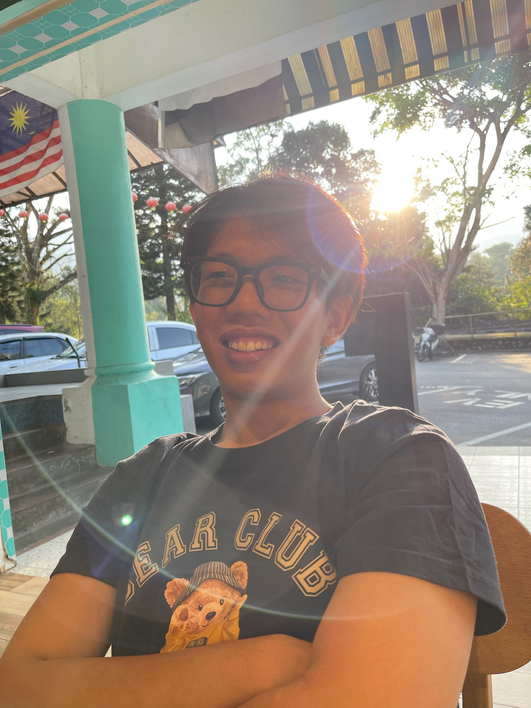
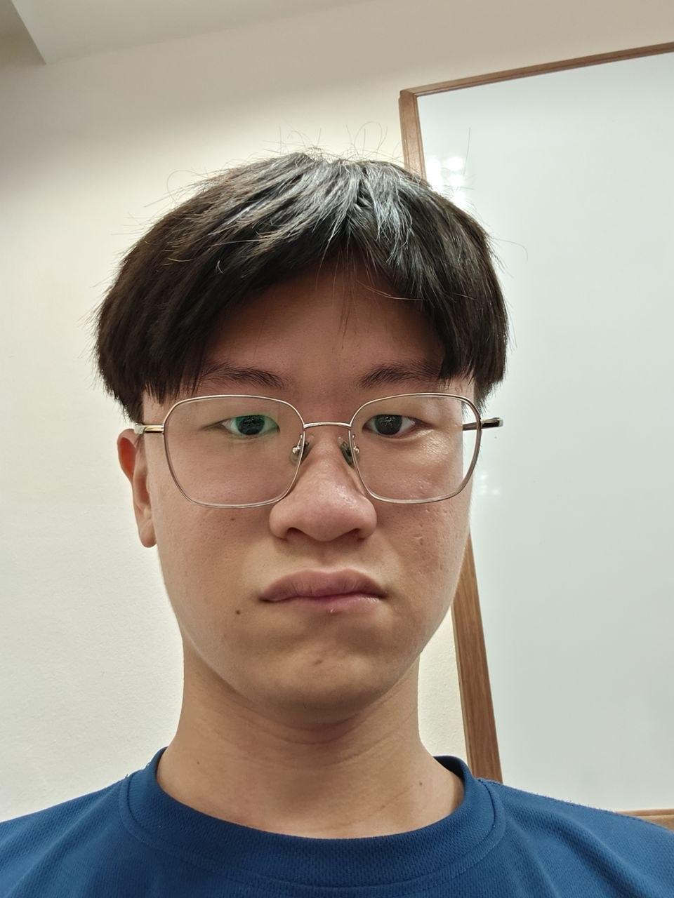
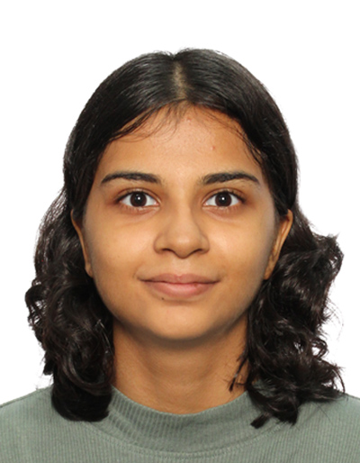
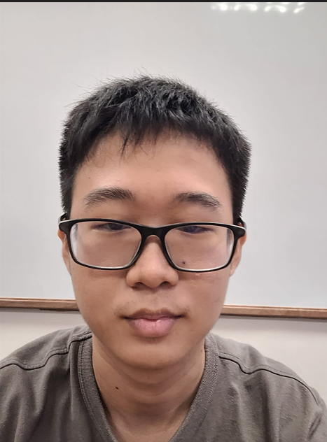
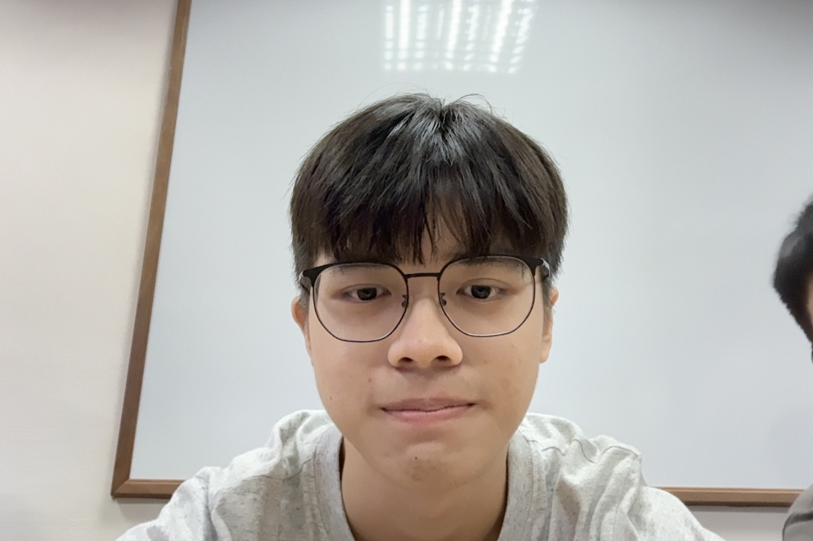

    ---
  layout: default.md
  title: "About Us"
---

# About Us

We are a team based in the [School of Computing, National University of Singapore](http://www.comp.nus.edu.sg).

You can reach us at the email `seer[at]comp.nus.edu.sg`

## Project team

### TEE MING SHUN

[[github](https://github.com/mingshun2005)]

* Role: Project Advisor

### Hoong Ken

[[github](http://github.com/hhkennn)]

* Role: Team Lead
* Responsibilities: UI

### Twisha Mehta

[[github](https://github.com/ahsiwt101)]

* Role: Developer
* Responsibilities: Data

### Chan Tze Yuon

[[github](http://github.com/tzeyuon)]
* Role: Integration
* Responsibilities: In charge of versioning the code, maintaining the code repository, and integrating various parts of the software to create a whole. 

### Kean Lai

[[github](https://github.com/JamesLee5182)]

* Role: Developer
* Responsibilities: UI
