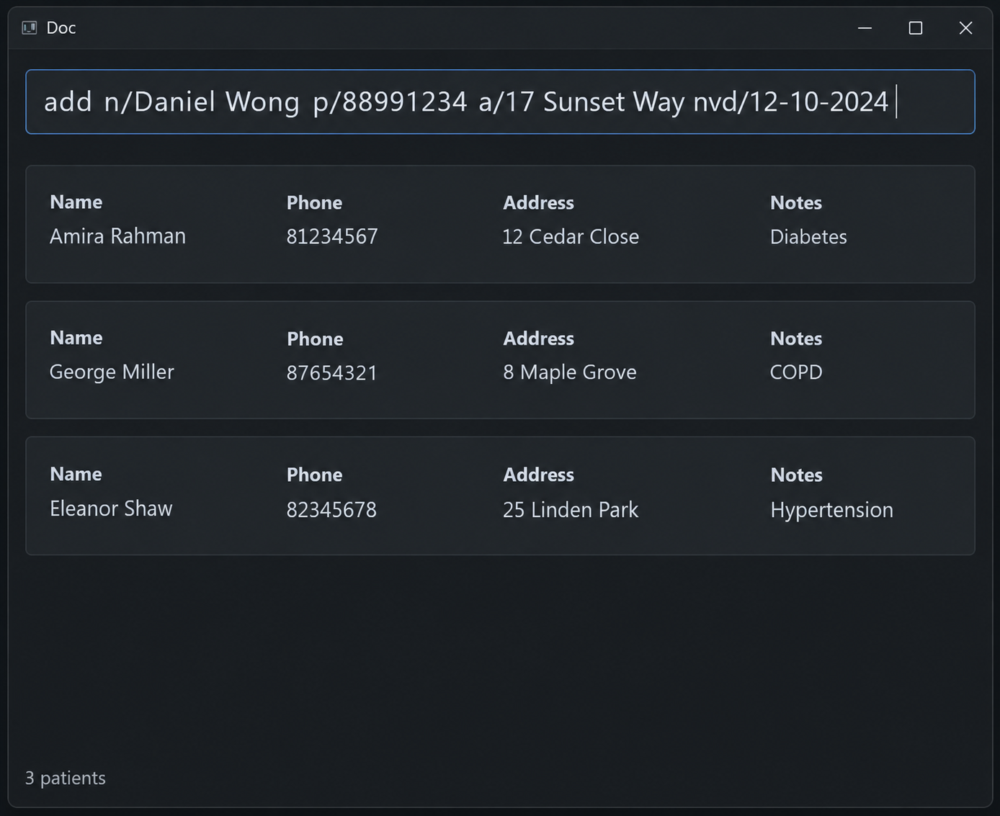

# AB-3 User Guide

AddressBook Level 3 (AB3) is a **desktop application for managing contacts, optimized for use through a Command Line Interface (CLI)** while retaining the benefits of a Graphical User Interface (GUI). If you type quickly, AB3 can help you manage contacts faster than traditional GUI applications.

<!-- * Table of Contents -->
<page-nav-print />

--------------------------------------------------------------------------------------------------------------------

## Quick start

1. Ensure that Java `25` or later is installed on your computer. 
   **Mac users:** Ensure you have the precise JDK version prescribed [here](https://se-education.org/guides/tutorials/javaInstallationMac.html).

1. Download the latest `.jar` file from [here](https://github.com/se-edu/addressbook-level3/releases).

1. Copy the file to the folder you want to use as the _home folder_ for your AddressBook.

1. Open a terminal, `cd` to the folder containing the JAR file, and run `java -jar addressbook.jar`. 
   A GUI similar to the one below should appear in a few seconds. Note how the app contains some sample data. 
   

1. Type a command in the command box and press Enter to execute it. For example, type **`help`** and press Enter to open the help window. 
   Some example commands you can try:

   * `list` : Lists all contacts.

   * `add n/John Doe p/98765432 e/johnd@example.com a/John street, block 123, #01-01` : Adds a contact named `John Doe` to the Address Book.

   * `delete 3` : Asks for confirmation before deleting the 3rd contact shown in the current list.

   * `clear` : Asks for confirmation before deleting all contacts.

   * `exit` : Exits the app.

1. Refer to the [Features](#features) section below for details of each command.

--------------------------------------------------------------------------------------------------------------------

## Features

<box type="info" seamless>

**Notes about the command format:** 

* Words in `UPPER_CASE` are the parameters to be supplied by the user. 
  For example, in `add n/NAME`, replace `NAME` with a value such as `John Doe`.

* Items in square brackets are optional. 
  For example, `n/NAME [t/TAG]` can be used as `n/John Doe t/friend` or as `n/John Doe`.

* Items followed by `...` can appear zero or more times. 
  For example, `[t/TAG]... ` may be omitted, or written as `t/friend` or `t/friend t/family`.

* Parameters can be in any order. 
  For example, if the command specifies `n/NAME p/PHONE_NUMBER`, `p/PHONE_NUMBER n/NAME` is also acceptable.

* Extraneous parameters for commands that take no parameters, such as `help`, `list`, `exit`, and `clear`, are ignored. 
  For example, `help 123` is interpreted as `help`.

* If you are using a PDF version of this document, be careful when copying and pasting commands that span multiple lines as space characters surrounding line-breaks may be omitted when copied over to the application.
</box>

### Navigating command history

The command box keeps commands submitted during the current application session so that you can reuse or edit them.

* Press <kbd>Up</kbd> to recall the most recently submitted command. Press it again to move to older commands. The
  oldest command remains displayed when there are no earlier commands.
* Press <kbd>Down</kbd> to move towards newer commands. After the newest command, pressing <kbd>Down</kbd> restores the
  unfinished text that was in the command box before you started browsing.
* Commands are recalled exactly as submitted, including spaces. Consecutive commands with exactly the same text are
  kept as one history entry so that navigation does not appear unresponsive. The same command is kept again when
  another command separates the submissions. Both successful and invalid commands are kept.
* Empty ordinary submissions and responses to follow-up prompts, such as `y` for a deletion confirmation, are not
  kept. While a follow-up prompt is pending, any recalled text you submit is still handled as the response to that
  prompt.
* Submitting a new command returns navigation to the newest command. The history is cleared when the application
  closes.

### Viewing help: `help`

Shows a message explaining how to access the help page.

Format: `help`

### Adding a person: `add`

Adds a person to the address book.

Format: `add n/NAME p/PHONE_NUMBER e/EMAIL a/ADDRESS [t/TAG]... `

<box type="tip" seamless>

**Tip:** A person can have any number of tags, including zero.
</box>

Examples:
* `add n/John Doe p/98765432 e/johnd@example.com a/John street, block 123, #01-01`
* `add n/Betsy Crowe t/friend e/betsycrowe@example.com a/Newgate Prison p/1234567 t/criminal`

### Listing all persons: `list`

Shows a list of all persons in the address book.

Format: `list`

### Sorting upcoming visits: `sort`

Shows all patients with visits today or later, ordered by visit date and time, earliest first.

Format: `sort`

* Today is determined using your computer's local date when you run the command. Earlier times today are included.
* Patients with identical visit dates and times keep their stored order.
* This replaces any previous search results. Past visits are hidden, not deleted.
* If there are no qualifying visits, the displayed list is empty.
* Use the displayed indices for subsequent commands such as `edit` or `delete`.
* `list` shows all patients again in stored order; `find` also returns to its usual order.
* Like `list`, extra parameters are ignored. Run `sort` again to refresh the date cutoff after midnight.

### Editing a person: `edit`

Edits an existing person in the address book.

Format: `edit INDEX [n/NAME] [p/PHONE] [a/ADDRESS] [vd/DATE_TIME] [e/EMAIL] [note/NOTES] [t/TAG]...`

* Edits the person at the specified `INDEX`. The index refers to the index number shown in the displayed person list. The index **must be a positive integer** 1, 2, 3, ...
* All editable fields are optional, but at least one must be provided.
* To update the visit date and time, use `vd/` with the format `d/M/yyyy HHmm`
  (e.g., `8/10/2026 1000`). A valid date and time in the past is accepted.
* The visit date and time can be edited by itself. Omitting `vd/` preserves the existing visit date and time.
* Omitted fields, including email and existing notes, keep their values. Use an empty `e/` to clear email.
* Use `note/NOTES` to replace the entire stored note. Use an empty `note/` to clear it; notes can be edited
  without `vd/`. An explicitly empty note counts as a supplied field, even when the note is already empty.
* Leading and trailing spaces and tabs in notes are trimmed; internal spaces are preserved. An empty value
  after trimming clears the note. A recognized prefix preceded by a literal space starts another field,
  even inside notes (e.g., `note/Review medication e/new@example.com` edits both notes and email).
  There is no escaping for literal prefix text.
* Prefixes can appear in any order. Repeated single-valued prefixes, including `note/`, are rejected,
  even when their values are identical or empty. Multiple `t/TAG` prefixes are allowed.
* Editing replaces the stored visit date and time; it does not append a visit-history entry.
* Existing values will be updated to the input values.
* When editing tags, all of the person's existing tags are removed; adding tags is not cumulative.
* To remove all of a person's tags, enter `t/` without a tag after it.

Examples:
* `edit 1 vd/8/10/2026 1000` Changes the 1st person's visit to 8 October 2026 at 10:00.
* `edit 1 p/91234567 vd/8/10/2026 1000 e/johndoe@example.com` Updates the visit, phone number, and email.
* `edit 1 p/91234567 e/johndoe@example.com` Updates the phone number and email, keeping the visit unchanged.
* `edit 1 e/` Clears the email, keeping the visit and other details unchanged.
* `edit 1 note/Patient requests a morning visit` Replaces the notes, keeping all other details unchanged.
* `edit 1 note/` Clears the notes, keeping all other details unchanged.
* `edit 1 e/ note/` Clears both email and notes, keeping the visit and other details unchanged.
* `edit 1 vd/8/10/2026 1000 e/new@example.com note/Review medication` Updates the visit, email, and notes.
* `edit 2 n/Betsy Crower t/` Updates the name and clears all existing tags, keeping the visit unchanged.

### Locating persons by name: `find`

Finds persons whose names contain any of the given keywords.

Format: `find KEYWORD [MORE_KEYWORDS]`

* The search is case-insensitive; for example, `hans` matches `Hans`.
* Keyword order does not matter; for example, `Hans Bo` matches `Bo Hans`.
* The search considers only names.
* Only full words match; for example, `Han` does not match `Hans`.
* Persons matching at least one keyword are returned (an `OR` search); for example, `Hans Bo` returns `Hans Gruber` and `Bo Yang`.

Examples:
* `find John` returns `john` and `John Doe`
* `find alex david` returns `Alex Yeoh`, `David Li` 
  

### Deleting a person: `delete`

Deletes the specified person from the address book.

Format: `delete INDEX`

* Deletes the person at the specified `INDEX`.
* The index refers to the index number shown in the displayed person list.
* The index **must be a positive integer** 1, 2, 3, ...
* A valid command displays `Delete NAME? Type y to confirm. Any other input cancels.` without deleting the person.
* Type `y` and press Enter to confirm. Surrounding spaces and letter case are ignored.
* Any other input, including an empty response or another valid command, cancels the deletion and is not run as a
  command. The result display then shows `Deletion cancelled.`
* Invalid `delete` commands continue to show the usual invalid-command response and do not ask for confirmation.

Examples:
* `list` followed by `delete 2`, then `y`, deletes the 2nd person in the address book.
* `find Betsy` followed by `delete 1`, then `y`, deletes the 1st person in the results of the `find` command.

### Clearing all entries: `clear`

Clears all entries from the address book.

Format: `clear`

* When the address book contains entries, the result display asks for confirmation and shows the number of entries
  that will be cleared.
* Type `y` and press Enter to confirm. Surrounding spaces and letter case are ignored.
* Any other input, including an empty response or another valid command, cancels the clear operation and is not run as
  a command. The result display then shows `Clear cancelled.`
* If the address book is empty, no confirmation is requested and the result display shows
  `Address book is already empty.`

Example: `clear` followed by `y` clears every entry.

### Exiting the program: `exit`

Exits the program.

Format: `exit`

### Saving the data

AddressBook automatically saves data after completed commands. Confirmation prompts, cancelled operations, and
`clear` on an empty address book do not write a file because they do not change stored data. You do not need to save
manually.

### Editing the data file

AddressBook data is saved automatically as a JSON file `[JAR file location]/data/addressbook.json`. Advanced users are welcome to update data directly by editing that data file.

<box type="warning" seamless>

**Caution:**
If your changes make the data file invalid, AddressBook starts with an empty address book at the next run. The invalid
file remains on disk until you run a command that triggers saving, such as `list`. Still, we recommend backing up the
file before editing it. 
Furthermore, certain edits can cause the AddressBook to behave in unexpected ways (e.g., if a value entered is outside of the acceptable range). Therefore, edit the data file only if you are confident that you can update it correctly.
</box>

### Archiving data files `[coming in v2.0]`

_Details coming soon ..._

--------------------------------------------------------------------------------------------------------------------

## FAQ

**Q**: How do I transfer my data to another computer? 
**A**: Install the app on the other computer and overwrite the data file it creates with the data file from your previous AddressBook home folder.

--------------------------------------------------------------------------------------------------------------------

## Known issues

1. **When using multiple screens**, if you move the application to a secondary screen, and later switch to using only the primary screen, the GUI will open off-screen. The remedy is to delete the `preferences.json` file created by the application before running the application again.
2. **If you minimize the Help Window** and then run the `help` command (or use the `Help` menu, or the keyboard shortcut `F1`) again, the original Help Window will remain minimized, and no new Help Window will appear. The remedy is to manually restore the minimized Help Window.

--------------------------------------------------------------------------------------------------------------------

## Command summary

Action     | Format, Examples
-----------|----------------------------------------------------------------------------------------------------------------------------------------------------------------------
**Add**    | `add n/NAME p/PHONE_NUMBER e/EMAIL a/ADDRESS [t/TAG]... `   e.g., `add n/James Ho p/22224444 e/jamesho@example.com a/123, Clementi Rd, 1234665 t/friend t/colleague`
**Clear**  | `clear`
**Delete** | `delete INDEX`  e.g., `delete 3`
**Edit**   | `edit INDEX [n/NAME] [p/PHONE_NUMBER] [a/ADDRESS] [vd/DATE_TIME] [e/EMAIL] [note/NOTES] [t/TAG]...`  e.g., `edit 2 note/Review medication`
**Find**   | `find KEYWORD [MORE_KEYWORDS]`  e.g., `find James Jake`
**List**   | `list`
**Sort**   | `sort`
**Help**   | `help`
